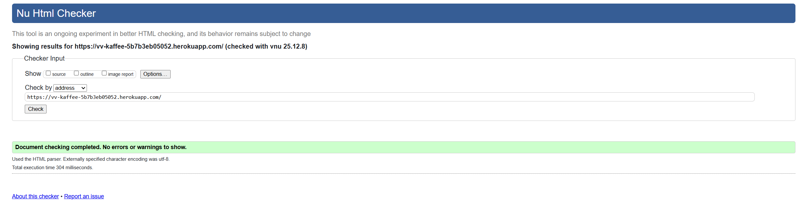
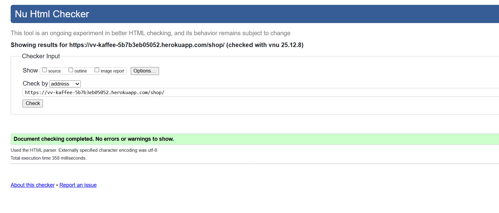

# Testing

This document summarizes the manual verifications and scans performed for the current build. Screenshots live under `static/images/testing_images/`.

## Environment
- Local: Windows 11, Python 3.12, Django dev server (`python manage.py runserver`).
- Browsers/tools: Chrome DevTools, Lighthouse, WAVE.
- Test data: sample products/orders in SQLite (`db.sqlite3`).

## Manual Regression
- Home page load, navigation, and hero:

  
- Shop/product listing and detail preview: `static/images/testing_images/shop_page_validation.png`, `static/images/testing_images/products_validated.png`.

    
- Cart add/remove/update totals: `static/images/testing_images/cart_validated.png`.
- My orders list/detail: `static/images/testing_images/oders_validation.png`.
- Account login and dashboard: `static/images/testing_images/login_wave_validation.png`, `static/images/testing_images/account_validated.png`, `static/images/testing_images/dashboard_validated.png`.
- Profile page edits: `static/images/testing_images/profile_validated.png`.
- Staff/admin surfaces: `static/images/testing_images/admin_page_validated.png`, `static/images/testing_images/fulfillment_page_validated.png`.

## Accessibility
- WAVE/aria scans on key auth pages and templates; see `static/images/testing_images/login_wave_validation.png` and page-specific validations listed above.

## Performance
- Lighthouse run on home/products: `static/images/testing_images/lighthouse_check-pass.png`, `static/images/testing_images/lighthouse_products_validated.png`.
- Notes: address image optimization and render-blocking hints from the report.

## Notes
- Additional screenshots are available for product images and general UI references: `static/images/testing_images/image.png` and `static/images/testing_images/image-1.png`.
